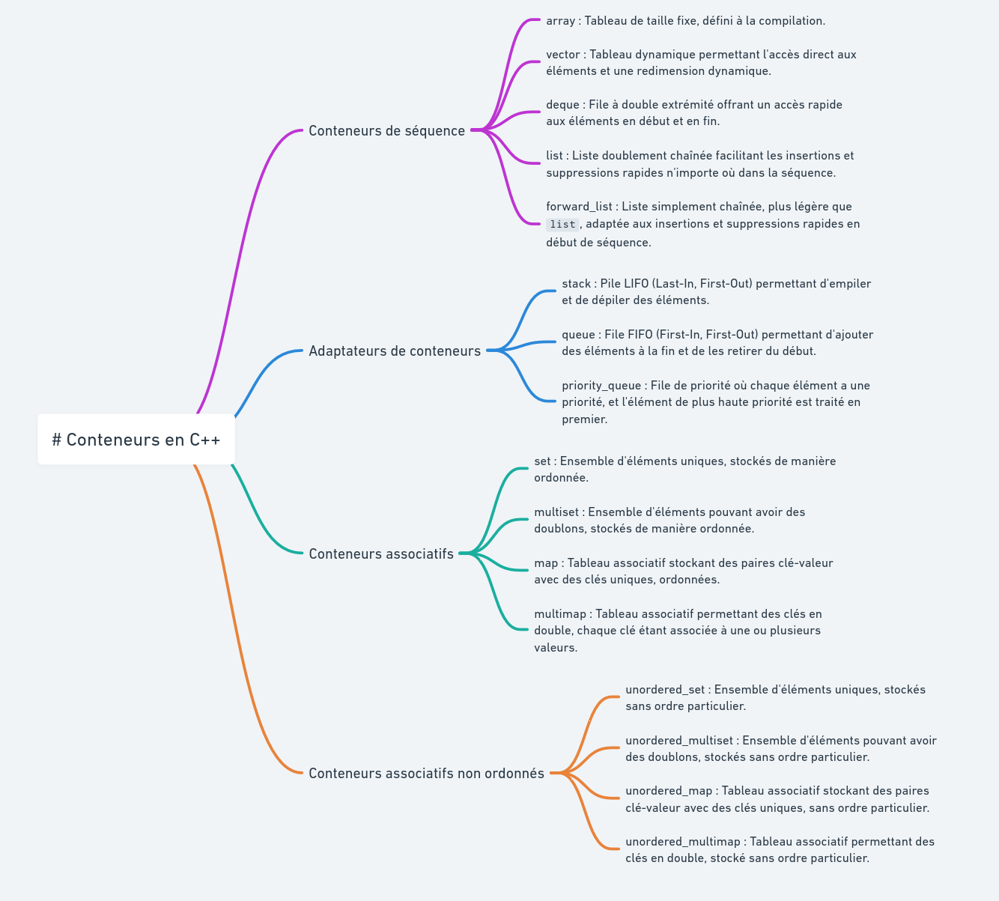
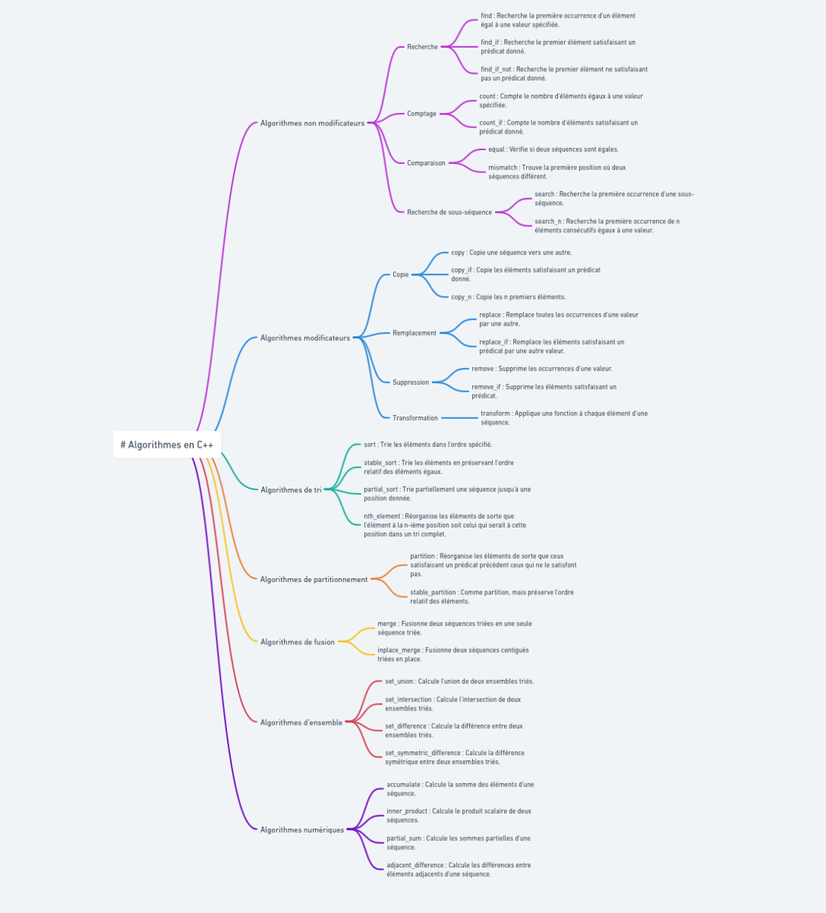

## Module CPP 08

[Containers](https://cplusplus.com/reference/stl/) \
[Iterators](https://cplusplus.com/reference/iterator/) \
[Algorithms](https://cplusplus.com/reference/algorithm/)

# Containers

```cpp
#include <iostream>
#include <map>
#include <vector>
#include <list>

class IOperation;

int main()
{
    std::list<int> lst1;
    std::map<std::string, IOperation*> map1;
    std::vector<int> v1;
    std::vector<int> v2(42, 100);

    lst1.push_back(1);
    lst1.push_back(17);
    lst1.push_back(42);

    map1["opA"] = new OperationA;
    map1["opB"] = new OperationB;

    std::list<int>::const_iterator it;
    std::list<int>::const_iterator ite = lst1.end(); //Pointer after the last element

    for (it = lst1.begin(); it != ite; ++it)
    {
        std::cout << *it << std::endl;
    }

    return (0);
}

```
# Algorithms

```cpp
#include <iostream>
#include <algorithm>
#include <list>

void displayInt(int i)
{
    std::cout << i << std::endl;
}

int main()
{
    std::list<int> lst;

    lst.push_back(10);
    lst.push_back(23);
    lst.push_back(3);
    lst.push_back(17);
    lst.push_back(20);

    for_each(lst.begin(), lst.end(), displayInt);

    return (0);
}

```
