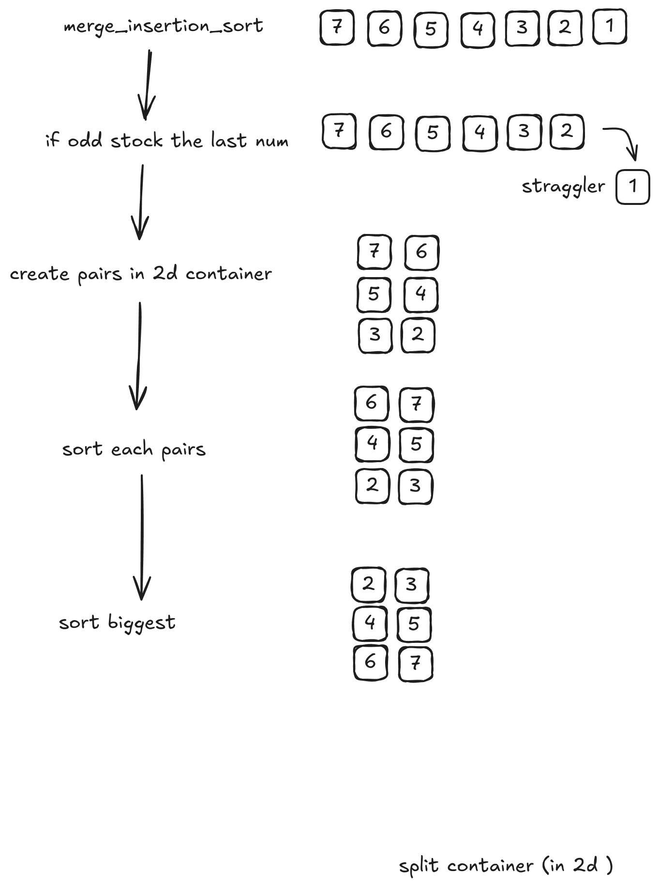

## Module 9
# Ford-Johnson algorithm
[Wikipedia](https://fr.wikipedia.org/wiki/Tri_par_fusion-insertion) \
[Original document](https://sci-hub.se/https://www.jstor.org/stable/2308750?origin=crossref) \
[dev.to](https://dev.to/emuminov/human-explanation-and-step-by-step-visualisation-of-the-ford-johnson-algorithm-5g91) \
[Jacobsthal number](https://en.wikipedia.org/wiki/Jacobsthal_number) \
[Template and Jacobsthal](https://medium.com/zerone-magazine/templates-and-compile-time-execution-c22234a6cd66) \
[Lien discord](https://discord.com/channels/774300457157918772/785407561246572554/1112889851428216862)
# Drawing
[Draw.io](https://app.diagrams.net/#G1qzLD8h60WpFFQuIJ7j9f6lEzIOKdi-h3#%7B%22pageId%22%3A%22xIoh2AFwNxPXTXQAX7JQ%22%7D) \

# Message on discord
Salut,
Merci <@255416214619291648>  pour les explications!

L’algo en lui-même se fait dans une seule fonction entièrement récursive, structurée comme suit :

template<typename bla>
void   f(bla first, bla last)   {

1. on fait des paires (x, y) et on trie dans chaque paire x < y ; la clé de chaque paire est sa valeur y,

2. appel récursif : on renvoie les paires faites à l’étape 1. dans f() jusqu’à ce qu’on n’ait plus qu’une paire (de paires de paires de paires etc.),

3. on déplie d'un niveau la ou les paire(s) reçue(s) et on insère avec un **binary search** les x dans la chaine de y, ou les paires qui correspondent à des x dans la chaîne des paires qui correspondent à des y*,

4. l’ordre d’insertion des x dans la chaîne de y se fait en suivant une des deux suites de Jacobsthal (0 1 1 3 5 11 21... ou 2 2 6 10 22...) choisie en fonction de comment on a fait l'algo.
}

*: Par ex., si on a à cette étape une paire de paires ((x0, y0), (x1, y1)), on sait que grâce à l’étape 1. on forcément x0 < y0 et y0 < y1. En conséquence, on peut directement insérer x0 devant y0 dans la chaîne des y.
Il ne reste qu’à insérer x1 dans la chaîne {x0, y0, y1} avec un binary search, en comparant x1 uniquement avec x0 et y0 et pas y1, puisque grâce à l’étape 1. on sait déjà que x1 < y1 : ici aussi on limite le nombre de comparaisons.

/////////////////////////////////////////////////////

Comme le mentionne Adrien, a priori ça se fait avec les itérateurs et, du coup, des groupes d'itérateurs (it + size), des swap et des range move de groupes d’itérateurs. Presque tout à templater.

Pour voir comment ça fonctionne, en c++ récent (pas de rétro convertion en c++98 possible 😘), voici le code de __Morwenn__, citée en réf dans les pages à peu près sérieuses sur le sujet, même dans la page assez trompeuse de en.wikipedia :

https://codereview.stackexchange.com/questions/116367/ford-johnson-merge-insertion-sort

Voilà. Bon courage à tous et surtout… bonne chance! 🙃
.
